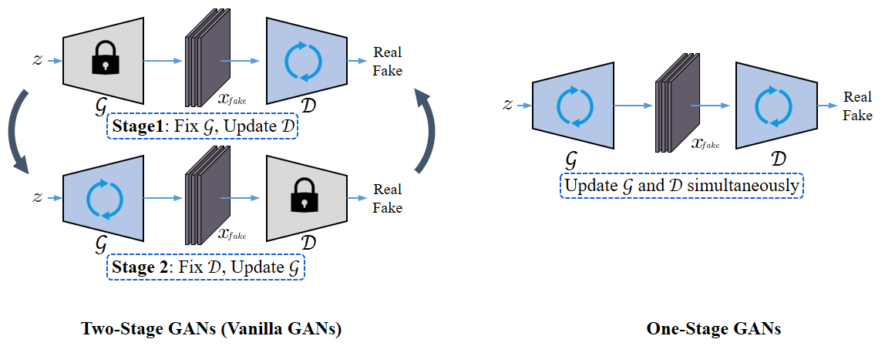
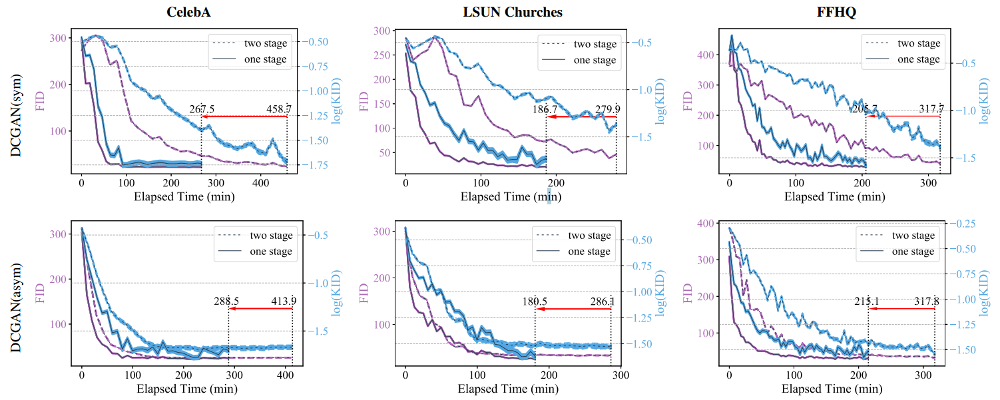
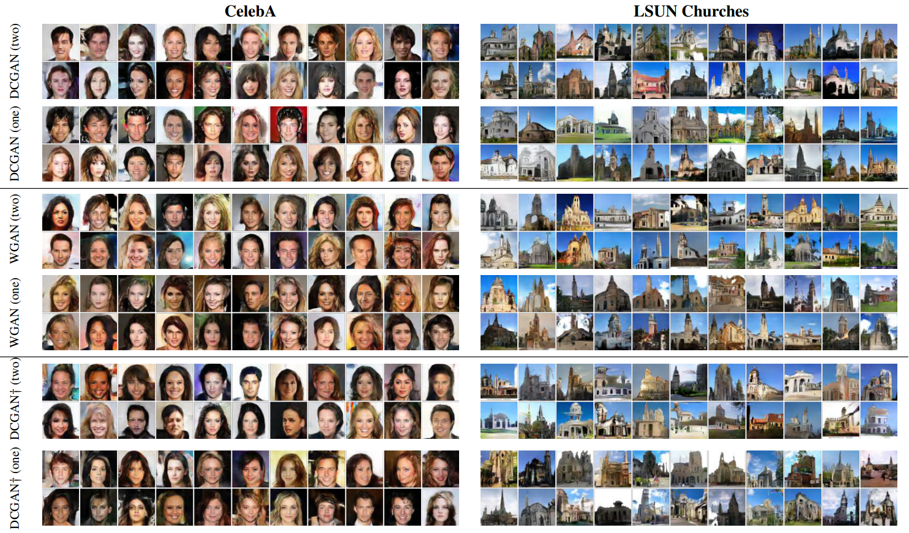

## One-Stage GANs (OSGAN)

In this work, we investigate a general training scheme that enables training GANs efficiently in only one stage. Based on the adversarial losses of the generator and discriminator, we categorize GANs into two classes, Symmetric GANs and Asymmetric GANs, and introduce a novel gradient decomposition method to unify the two, allowing us to train both classes in one stage and hence alleviate the training effort. We also computationally analyze the efficiency of the proposed method, and empirically demonstrate that, the proposed method yields a solid 1.5× acceleration across various datasets and network architectures. 





## Requirements

```sh
conda create -n osgan python=3.7
pip install -r requirements.txt
```


## Datasets

### 1. MNIST

Use `MNIST` class in `torchvision` to download and process MNIST and put it in `./data/`.

### 2. CelebA

Download CelebA from `http://mmlab.ie.cuhk.edu.hk/projects/CelebA.html`.

Put aligned images of CelebA in `./data/img_align_celeba` and run

```sh
python build_dataset.py
```


## Training

Select training dataset by editing the corresponding python scripts as follows and run it.

```sh
# ----------- Run Symmetric DCGAN (Two Stage) -----------
python train_dcgan_symmetric_two_stage.py

# ----------- Run Symmetric DCGAN (One Stage) -----------
train_dcgan_symmetric_one_stage.py

# ----------- Run Asymmetric DCGAN (Two Stage) -----------
python train_dcgan_asymmetric_two_stage.py

# ----------- Run Asymmetric DCGAN (One Stage) -----------
python train_dcgan_asymmetric_one_stage.py
# OR 
python train_dcgan_asymmetric_one_stage_simple.py

# ----------- Run WGAN (Two Stage) -----------
python train_wgan_dcgan_two_stage.py

# ----------- Run WGAN (One Stage) -----------
python train_wgan_dcgan_one_stage.py
```


## Results

### 1. Training Curves




### 2. Visualization




## Citation

```
@InProceedings{shen2021training,
    author    = {Shen, Chengchao and Yin, Youtan and Wang, Xinchao and Li, Xubin and Song, Jie and Song, Mingli},
    title     = {Training Generative Adversarial Networks in One Stage},
    booktitle = {Proceedings of the IEEE Conference on Computer Vision and Pattern Recognition (CVPR)},
    month     = {June},
    year      = {2021},
    pages     = {3350-3360}
}
```

